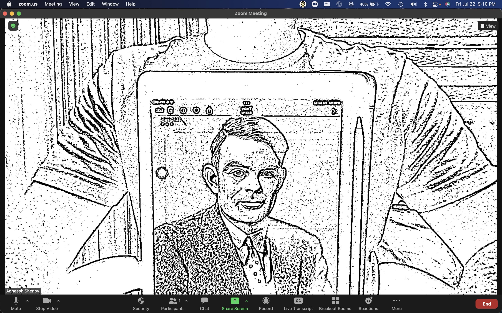
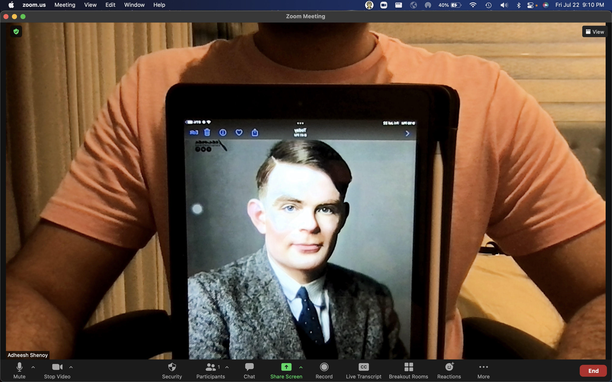
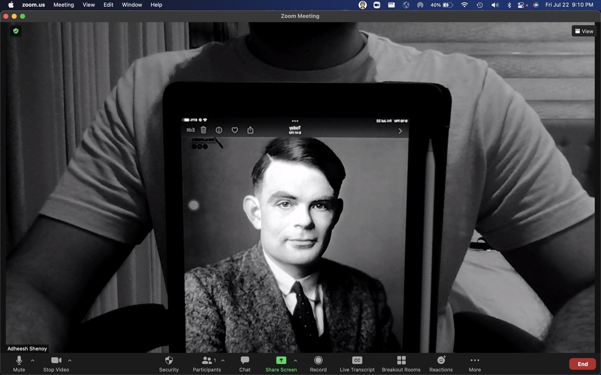
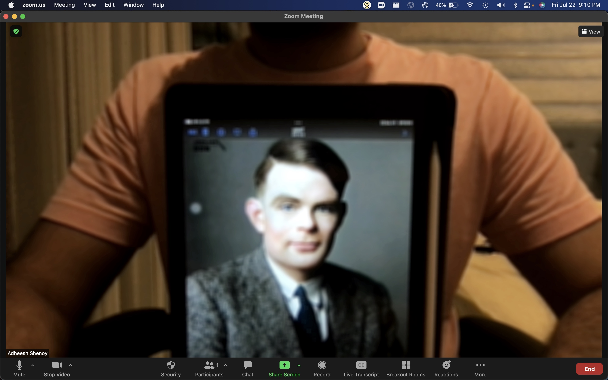
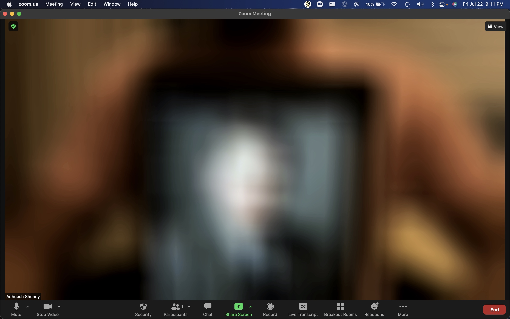
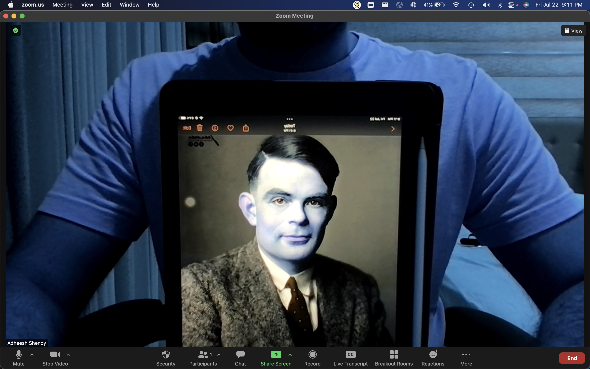

# Smart Webcam


This project is a MacOS Statusbar Application that adds additional image filters to the webcam output for applications such as Microsoft Teams and Zoom. The app was tested on an Intel Macbook Pro running MacOS Monterey 12.4

The filters/features present in this application are:

PS: The videos look like they are stuttering as they are gifs and not mp4. Original mp4 videos can be found in the README_media folder

- No Filter

- Smart Blur: Blurs the webcam feed when a face is not present. 

https://user-images.githubusercontent.com/51925368/180621724-84622ced-e01a-4d90-9e93-4b89971a2ab7.mp4

- Smart Face Blur: Blur the face of the user and blurs the entire screen when the face is not present in the screen

https://user-images.githubusercontent.com/51925368/180621737-6c3a9877-179c-4cd8-85d1-06022318fe98.mp4

- Top-Down Camera (COLOR): Provides a colored top down view of a user defined area

- Top-Down Camera (DOCUMENT): Provides a black and white, top-down view of a user defined area

https://user-images.githubusercontent.com/51925368/180621741-ba688030-1e7f-4662-92e3-8f7623aa0a3b.mp4

- Sketch Filter: Makes the webcame feed look like a black and white drawing


- High Contrast: Adds a high contrast filter to the webcam feed


- GreyScale: Makes the webcam feed grey


- Blur: Slightly blurs the webcam feed


- Extreme Blur: Excessivly blurs the webcam feed


- RGB2BGR: Switchs the Red and Blue channels in the webcam


# Table of contents

- [Installation](#installation)
- [Usage](#usage)
- [Troubleshoot](#troubleshoot)
- [Development](#development)
- [Conclusion](#conclusion)

# Installation
[(Back to top)](#table-of-contents)

Before installation make sure you have python3 set up on the computer. This project was built using python version 3.7

Follow the following steps for installation:

1. Download [OBS studio](https://obsproject.com)
2. Run OBS studio
3. Click "Start Virtual Camera" and wait for 2 seconds. 
4. Click Stop Virtual Camera and shut OBS studio

Steps 3 and 4 create a Virtual camera that can be selected when using applications such as Microsoft Teams and Zoom

5. Download this repository using git clone or the .zip file download link

6. Download all the dependencies using the following command:

```
pip3 install -r requirements.txt
or 
pip install -r requirements.txt
```

6. Run the command ```python3 setup.py py2app```. This should create two folders, build and dist. The dist folder shall contain your application executable. 

7. Double click on the executable to run the program. The logo should be visible in the status bar. 

8. You can now move the executable to the applications folder in your mac

# Usage
[(Back to top)](#table-of-contents)

1. Click on the logo in your status bar
2. Click the filter you wish to use
3. Open your application (Tested on Zoom and Microsoft Teams) and select OBS Virtual Camera as your webcam input
4. To switch filters, click the logo in the status bar and click switch mode followed by the new filter
5. Finally, to quit the app, click quit

# Installation
[(Back to top)](#table-of-contents)

1. If the application runs but the camera feed is not visible:
- Run the get_camera_count.py script using the command ```python3 get_camera_count.py``` and note the output
- Cycle through the values [0, output) and change the value of the variable self.camera_index in status_bar_app.py. For example, if the output of get_camera_count.py is 2. We would change the value of self.camera_index to 0, recompile the app and check if it works. If it does not work, we would change the value of self.camera_index to 1, and follow the same procedure.  
The reason for this error is that opencv cannot connect with the correct webcam

# Development
[(Back to top)](#table-of-contents)

## TL;DR
- Utilized OpenCV to apply filters such as Histogram equalization, Adaptive Threshold, Blur and warp perspective on a video feed 
- Tracked facial and Hand features using Google MediaPipe
- Developed a face tracking filter that updates video feed accordingly based on the presence of a face within the feed
- Mimicked Apple's [Continuity Camera](https://www.youtube.com/watch?v=krnZUfixffY) by processing a user defined area to provide a top down view
- Created a MacOS Status bar application to use the filters

## Code Overview
### class FrameGen:
- Found in frame_generator.py
- Handles all the image processing

### class UserInput:
- Found in ui.py
- Handles loading of any necessary arguments/models

### class CoordinateState:
- Found in ui.py
- Holds the coordinates that have been defined by the user when using the top-down view filter
- Holds additional functions such as drawing pointers, drawing hand features, etc.

### class SmartCam
- Found in status_bar_app.py
- Main class that handles the application

For most of the filters, there is a equivalent OpenCV tutorial available. Therefore, in this section I shall only discuss the Smart Face Blur and the Top-down view filters. 

## Smart Face Blur
### Pseudocode
```
Process image through media pipe face detector
if face detected:
    Extract ROI
    Blur ROI
    Replace blurred section in image with ROI
else:
    Blur entire image

```

## Top-Down View
### Pseudocode
```
Initialize CoordinateState
if CoordinateState does not contain 4 coordinates:
    Process image through mediapipe hand detector
    Get location of the index finger tip
    Compare location with previous location
    if location has remained unchanged for 20 frames:
        add coordinate to CoordinateState
        plot coordinate on image
else:
    Change image perspective based on the 4 coordinates in CoordinateState
    Apply Adaptive Thresholding to improve the sharpness and contrast of the image
```

# Conclusion
[(Back to top)](#table-of-contents)

Overall this was an interesting project to work on. Based on the feedback I received from my LinkedIn post, it seems that a lot of people found the application interesting as well. If anyone has any additional ideas, or thoughts on the work, feel free to reach out! Thank you!
